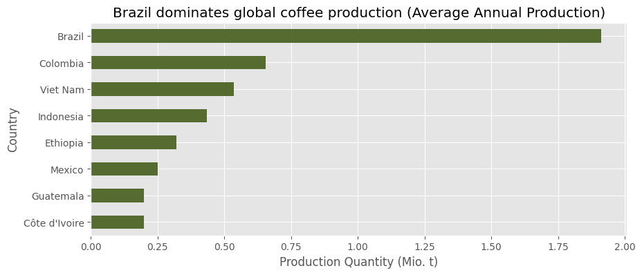

# Global Green Coffee Data Analysis

This notebook explores the global coffee industry with a focus on production, trade, and consumption trends. By analyzing data on green coffee production, harvested areas, imports, exports, and consumption patterns, this project aims to uncover interesting insights and phenomena that shape the coffee market worldwide to better understand the dynamics of this essential commodity.

> Green Coffe Production and Harvest: 

-- --

> Online Interactive Demo: 

-- -- 
> Sources:

Data Sets by FOASTAT DATABASE: https://www.fao.org/faostat/en/

1. Crops and Livestock Products (Production)

- Production Quantity - Amount of green coffee (in tonnes) produced in a country in a given year. Your main metric for coffee production.

- Area Harvested - Total area used for coffee cultivation.

2. Crops and Livestock Products (Trade)

- Export Quantity - Amount of green coffee (in tonnes) exported by a country.

- Import Quantity - Amount of green coffee (in tonnes) imported by a country.

- Export Value - Monetary value (in 1,000 USD) of exported green coffee. Represents the country’s revenue.

- Import Value - Monetary value (in 1,000 USD) of imported green coffee. Represents the country’s expenditure.

3. Food Balances

- Stock Variation - Change in coffee stock (in tonnes) over a year (positive = increase, negative = decrease).

- Food Supply Quantity (kg/capita/year) - Coffee available per person for human consumption (in kg/year). Important for the “cup” perspective.

- Total Population - Total population of the country.